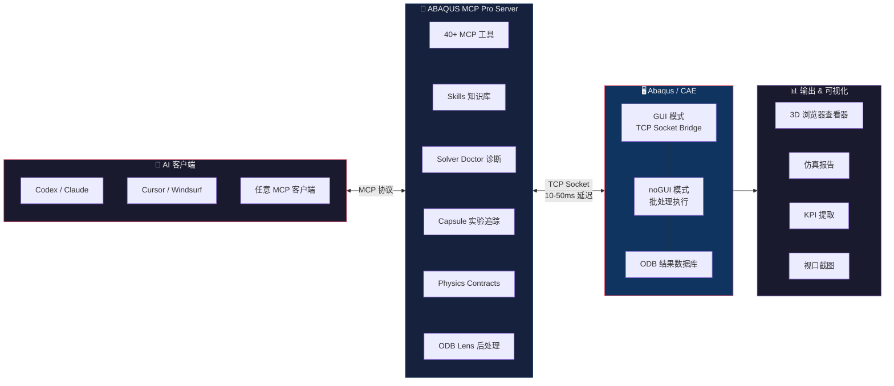

<div align="center">


<br>
<br>

```
  ___  ______   ___   _____  _   _  _____  ___  ___ _____ ______  ______ ______  _____ 
 / _ \ | ___ \ / _ \ |  _  || | | |/  ___| |  \/  |/  __ \| ___ \ | ___ \| ___ \|  _  |
/ /_\ \| |_/ // /_\ \| | | || | | |\ `--.  | .  . || /  \/| |_/ / | |_/ /| |_/ /| | | |
|  _  || ___ \|  _  || | | || | | | `--. \ | |\/| || |    |  __/  |  __/ |    / | | | |
| | | || |_/ /| | | |\ \/' /| |_| |/\__/ / | |  | || \__/\| |     | |    | |\ \ \ \_/ /
\_| |_/\____/ \_| |_/ \_/\_\ \___/ \____/  \_|  |_/ \____/\_|     \_|    \_| \_| \___/ 
```

**AI-Native Abaqus Automation — MCP Server + 3D Viewer + Solver Doctor**

[English](README.md) · [中文](README_ZH.md)

</div>

---

## What is it?

ABAQUS MCP Pro connects your AI assistant directly to Abaqus/CAE over a TCP socket bridge. You describe the simulation task in natural language, and the AI executes it in real time — building geometry, assigning materials, submitting jobs, diagnosing errors, and visualizing results.

> *"Create a cantilever beam with a 10 kN tip load, mesh with C3D8R elements, and submit the job."*

The AI handles every step through MCP tools, and the model updates live in your Abaqus window.




---

## Quick Start

```bash
# 1. Install
pip install -e .
abaqus-mcp-pro-setup

# 2. Launch Abaqus/CAE, then activate the plugin
#    Plug-ins > ABAQUS MCP Pro > Start MCP Bridge

# 3. Connect your AI client
codex mcp add abaqus-mcp-pro -- python "path/to/server.py"

# 4. Start talking to Abaqus
#    "Create a tensile bar model with steel properties..."
```

---

## Highlights

<table>
<tr>
<td width="33%" align="center">
<h3>⚡ 10-50ms Latency</h3>
TCP socket bridge. No file I/O, no polling.
</td>
<td width="33%" align="center">
<h3>🔧 23 MCP Tools</h3>
Model · Job · ODB · KPI · Capsule · Contract · Report · Viewport
</td>
<td width="33%" align="center">
<h3>🖥️ Live in GUI</h3>
Geometry, mesh, and results update in your current Abaqus window.
</td>
</tr>
<tr>
<td align="center">
<h3>🌐 3D Result Viewer</h3>
One-click ODB → interactive browser visualization. Three.js, zero dependencies.
</td>
<td align="center">
<h3>🩺 Solver Doctor</h3>
40+ error patterns auto-diagnosed with fix suggestions.
</td>
<td align="center">
<h3>🔒 Local Only</h3>
Bridge listens on `127.0.0.1:48152`. Data never leaves your machine.
</td>
</tr>
</table>

---

## Architecture

<div align="center">

```
┌──────────────────┐
│  AI Client       │  "Create a steel bracket..."
│  (Codex/Claude)  │
└────────┬─────────┘
         │ stdio
         ▼
┌──────────────────┐
│  MCP Server      │  server.py
│  (23 tools)      │
└────────┬─────────┘
         │ TCP :48152
         ▼
┌──────────────────┐
│  GUI Plugin      │  agent.py
│  (inside Abaqus) │
└────────┬─────────┘
         │ Abaqus Python API
         ▼
┌──────────────────┐
│  Abaqus/CAE      │
│  Kernel          │
└──────────────────┘
```

</div>

---

## Browser 3D Result Viewer

> **One command. Zero npm. Instant 3D.**

```bash
python viewer/serve_viewer.py
# → http://localhost:8080
```

Drop an ODB path, click **Export**, and inspect your model in the browser:

- **Orbit / pan / zoom** with mouse controls
- **Field coloring** — stress, displacement, PEEQ with jet colormap & legend
- **Wireframe** toggle · **Deformed shape** toggle · **Animation** playback
- **C3D4/5/6/8/10/15/20** · **S3/4/6/8** · **M3D3/4** — full element type support

<table>
<tr>
<td>

**From Python:**
```python
from abaqus_mcp_pro.export_result_mesh import export_result_mesh
export_result_mesh("my_job.odb", "result_mesh.json")
```

</td>
<td>

**From MCP:**
```
AI: "export_result_mesh for my_job.odb"
→ result_mesh.json created
→ load in viewer
```

</td>
</tr>
</table>

---

## Tools Reference

| Category | Tool | What it does |
|----------|------|---------------|
| **Bridge** | `ping` | Connection health + session status |
| | `check_abaqus_connection` | Human-readable status report |
| **Code** | `run_python` | Execute arbitrary Python in Abaqus kernel |
| | `execute_script` | Compatibility wrapper (stdout text) |
| | `set_workdir` | Change working directory |
| **Model** | `get_model_info` | Parts, materials, steps, loads, BCs |
| **Job** | `list_jobs` | All jobs and their status |
| | `submit_job` | Submit and wait for completion |
| | `monitor_job_status` | Tail .sta / .msg diagnostics |
| | `diagnose_job` | Solver Doctor: 40+ error patterns |
| **ODB** | `inspect_odb` | Frames, variables, sections |
| | `get_odb_info` | Compatibility wrapper |
| | `extract_kpis` | ODB Lens: KPI extraction |
| | `export_result_mesh` | Export to 3D viewer JSON |
| **Capsule** | `create_capsule` | Save experiment state snapshot |
| | `list_capsules` | List saved capsules |
| | `load_capsule` | Load a saved capsule |
| | `delete_capsule` | Delete a saved capsule |
| | `compare_capsules` | Diff two capsules |
| **Contract** | `check_physics_contracts` | Validate physics contracts |
| **Report** | `generate_report` | Simulation report (Markdown) |
| **Viewport** | `capture_viewport` | Screenshot as base64 |
| | `get_viewport_image` | Compatibility wrapper |

---

## Installation

### Prerequisites

| Requirement | Version |
|-------------|---------|
| Python | 3.10+ |
| Abaqus | 2024+ (Python 3.10) |
| AI Client | Codex, Claude Desktop, etc. |

### Install

```bash
pip install -e .
abaqus-mcp-pro-setup          # Install GUI plugin into Abaqus
```

### Environment Variables

| Variable | Default | Description |
|----------|---------|-------------|
| `ABAQUS_MCP_HOST` | `127.0.0.1` | TCP host |
| `ABAQUS_MCP_PORT` | `48152` | TCP port |
| `ABAQUS_MCP_TIMEOUT` | `60` | Socket timeout (seconds) |
| `ABAQUS_MCP_MAX_MESSAGE_BYTES` | `33554432` | Max message size |
| `ABAQUS_MCP_PLUGIN_DIR` | `~/abaqus_plugins` | Plugin install directory |
| `ABAQUS_MCP_HOME` | auto-detect | File IPC working directory |

---

## Modes of Operation

```bash
# GUI mode (primary) — launch Abaqus/CAE, activate plugin from Plug-ins menu

# noGUI mode — batch execution
abaqus cae noGUI=scripts/start_abaqus_mcp_pro_agent.py

# File IPC fallback
abaqus cae noGUI=scripts/start_abaqus_mcp_pro_ipc.py
```

---

## CLI Tools

```bash
abaqus-mcp-pro-check     # Check bridge connectivity
abaqus-mcp-pro-doctor    # Full system diagnostics
abaqus-mcp-pro-setup     # Install / update GUI plugin
```

---

## Python API

```python
from abaqus_mcp_pro.client import AbaqusBridgeClient

client = AbaqusBridgeClient(timeout=60)
result = client.execute("from abaqus import mdb; result = list(mdb.models.keys())")
print(result["return_value"])  # ["Model-1", ...]
```

---

## Project Structure

```
abaqus-mcp-pro/
├── src/abaqus_mcp_pro/
│   ├── server.py             # MCP stdio server
│   ├── tools.py              # 23 MCP tools
│   ├── resources.py          # MCP resources
│   ├── prompts.py            # 13 MCP prompts
│   ├── skills.py             # 74 skill resources
│   ├── transport.py          # Socket + file IPC
│   ├── solver_diagnosis.py   # Solver Doctor
│   ├── odb_lens.py           # ODB Lens: KPI extraction
│   ├── capsule.py            # Experiment state tracking
│   ├── contracts.py          # Physics contracts
│   ├── report.py             # Report generation
│   ├── export_result_mesh.py # ODB → JSON export
│   ├── agent.py              # Abaqus-side TCP agent
│   ├── gui_plugin.py         # Abaqus/CAE GUI plugin
│   ├── file_ipc_plugin.py    # File IPC fallback
│   ├── client.py             # TCP client
│   ├── protocol.py           # JSON protocol
│   └── cli.py                # CLI entry points
├── viewer/
│   ├── serve_viewer.py       # One-click 3D viewer server
│   ├── index.html            # Viewer UI
│   ├── main.js               # Three.js engine
│   └── *.result_mesh.json    # Test data
├── scripts/                  # noGUI launchers
├── examples/                 # Example scripts
├── tests/                    # Test suite
├── pyproject.toml
└── README.md
```

---

## Troubleshooting

| Symptom | Fix |
|---------|-----|
| `WinError 10061` connection refused | Start the bridge: **Plug-ins > ABAQUS MCP Pro > Start MCP Bridge** |
| Connection timeout | Start plugin first, then MCP server |
| `Module abaqusGui can only be used...` | Use **Plug-ins** menu, not File > Run Script |
| Model not in GUI | `abaqus-mcp-pro-check` → verify `"thread": "MainThread"` |
| Codex can't see tools | `codex mcp list` → restart Codex if not listed |
| `abaqus-mcp-pro-server` not found | Reinstall or run `abaqus-mcp-pro-doctor` |

---

## Credits

- [Abaqus-Control-MCP](https://github.com/Whfkl/Abaqus-Control-MCP) — TCP socket bridge, AST diagnostics
- [CAE-Agent-Hub](https://github.com/Cai-aa/CAE-Agent-Hub) — High-level tools & architecture
- [abaqus-mcp](https://github.com/Cai-aa/abaqus-mcp) — File-based IPC transport
- [Codex_MCP_Abaqus](https://github.com/Zhangyoupeng1996/Codex_MCP_Abaqus) — noGUI mode & examples

---

<div align="center">

**MIT License** · [View License](LICENSE)

Made with 🔬 for the CAE community

</div>
