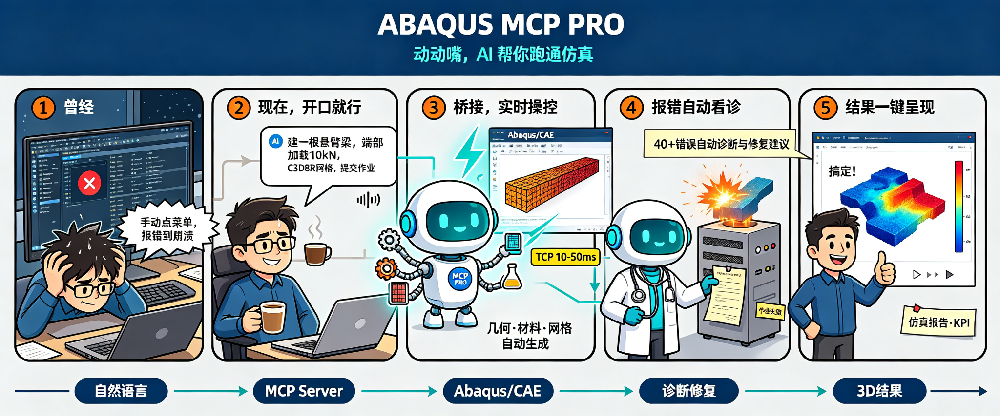

<div align="center">


<br>
<br>

```
  ___  ______   ___   _____  _   _  _____  ___  ___ _____ ______  ______ ______  _____ 
 / _ \ | ___ \ / _ \ |  _  || | | |/  ___| |  \/  |/  __ \| ___ \ | ___ \| ___ \|  _  |
/ /_\ \| |_/ // /_\ \| | | || | | |\ `--.  | .  . || /  \/| |_/ / | |_/ /| |_/ /| | | |
|  _  || ___ \|  _  || | | || | | | `--. \ | |\/| || |    |  __/  |  __/ |    / | | | |
| | | || |_/ /| | | |\ \/' /| |_| |/\__/ / | |  | || \__/\| |     | |    | |\ \ \ \_/ /
\_| |_/\____/ \_| |_/ \_/\_\ \___/ \____/  \_|  |_/ \____/\_|     \_|    \_| \_| \___/ 
```

**AI 原生 Abaqus 自动化 — MCP 服务器 + 3D 查看器 + 求解器诊断**

[English](README.md) · [中文](README_ZH.md)

</div>

---

## 这是什么？

ABAQUS MCP Pro 通过 TCP socket 桥接将 AI 助手直接连接到 Abaqus/CAE。你用自然语言描述仿真任务，AI 实时执行 — 建立几何、赋予材料、提交作业、诊断错误、可视化结果。

> *"创建一个悬臂梁，端部施加 10 kN 载荷，用 C3D8R 单元划分网格，提交作业。"*

AI 通过 MCP 工具完成每一步操作，模型在你的 Abaqus 窗口中实时更新。

<div align="center">
  
  <p><em>ABAQUS MCP Pro -- AI-Native Abaqus Automation Workflow</em></p>
</div>

````


---

## 快速开始

```bash
# 1. 安装
pip install -e .
abaqus-mcp-pro-setup

# 2. 启动 Abaqus/CAE，激活插件
#    Plug-ins > ABAQUS MCP Pro > Start MCP Bridge

# 3. 连接 AI 客户端
codex mcp add abaqus-mcp-pro -- python "path/to/server.py"

# 4. 开始与 Abaqus 对话
#    "创建一个拉伸试棒模型，使用钢材属性..."
```

---

## 亮点

<table>
<tr>
<td width="33%" align="center">
<h3>⚡ 10-50ms 延迟</h3>
TCP socket 桥接，无文件 I/O，无轮询。
</td>
<td width="33%" align="center">
<h3>🔧 23 个 MCP 工具</h3>
模型 · 作业 · ODB · KPI · 胶囊 · 合约 · 报告 · 视口
</td>
<td width="33%" align="center">
<h3>🖥️ GUI 实时可见</h3>
几何、网格、结果在当前 Abaqus 窗口中即时更新。
</td>
</tr>
<tr>
<td align="center">
<h3>🌐 3D 结果查看器</h3>
一键 ODB → 浏览器交互可视化。Three.js，零依赖。
</td>
<td align="center">
<h3>🩺 求解器诊断</h3>
40+ 种错误模式自动检测并提供修复建议。
</td>
<td align="center">
<h3>🔒 仅本地运行</h3>
桥接监听 `127.0.0.1:48152`，数据不会离开你的机器。
</td>
</tr>
</table>

---

## 架构

<div align="center">

```
┌──────────────────┐
│  AI 客户端       │  "创建一个钢制支架..."
│  (Codex/Claude)  │
└────────┬─────────┘
         │ stdio
         ▼
┌──────────────────┐
│  MCP 服务器      │  server.py
│  (23 个工具)     │
└────────┬─────────┘
         │ TCP :48152
         ▼
┌──────────────────┐
│  GUI 插件        │  agent.py
│  (Abaqus 内部)   │
└────────┬─────────┘
         │ Abaqus Python API
         ▼
┌──────────────────┐
│  Abaqus/CAE      │
│  内核            │
└──────────────────┘
```

</div>

---

## 浏览器 3D 结果查看器

> **一条命令。零 npm。即时 3D。**

```bash
python viewer/serve_viewer.py
# → http://localhost:8080
```

输入 ODB 路径，点击 **Export**，在浏览器中查看模型：

- **鼠标旋转 / 平移 / 缩放**
- **场变量着色** — 应力、位移、PEEQ，jet 色标 + 图例
- **线框** 切换 · **变形** 切换 · **动画** 播放
- **C3D4/5/6/8/10/15/20** · **S3/4/6/8** · **M3D3/4** — 全单元类型支持

<table>
<tr>
<td>

**Python 调用：**
```python
from abaqus_mcp_pro.export_result_mesh import export_result_mesh
export_result_mesh("my_job.odb", "result_mesh.json")
```

</td>
<td>

**MCP 调用：**
```
AI: "导出 my_job.odb 的 result_mesh"
→ result_mesh.json 已创建
→ 在查看器中加载
```

</td>
</tr>
</table>

---

## 工具参考

| 类别 | 工具 | 说明 |
|------|------|------|
| **桥接** | `ping` | 连接健康检查 + 会话状态 |
| | `check_abaqus_connection` | 人类可读的状态报告 |
| **代码** | `run_python` | 在 Abaqus 内核中执行任意 Python |
| | `execute_script` | 兼容包装器（返回 stdout 文本） |
| | `set_workdir` | 修改工作目录 |
| **模型** | `get_model_info` | 部件、材料、分析步、载荷、边界条件 |
| **作业** | `list_jobs` | 所有作业及其状态 |
| | `submit_job` | 提交作业并等待完成 |
| | `monitor_job_status` | 读取 .sta / .msg 诊断信息 |
| | `diagnose_job` | 求解器诊断：40+ 错误模式 |
| **ODB** | `inspect_odb` | 帧、变量、截面信息 |
| | `get_odb_info` | 兼容包装器 |
| | `extract_kpis` | ODB 透镜：KPI 提取 |
| | `export_result_mesh` | 导出为 3D 查看器 JSON |
| **胶囊** | `create_capsule` | 保存实验状态快照 |
| | `list_capsules` | 列出已保存的胶囊 |
| | `load_capsule` | 加载已保存的胶囊 |
| | `delete_capsule` | 删除已保存的胶囊 |
| | `compare_capsules` | 对比两个胶囊 |
| **合约** | `check_physics_contracts` | 验证物理合约 |
| **报告** | `generate_report` | 生成仿真报告（Markdown） |
| **视口** | `capture_viewport` | 截取视口图像为 base64 |
| | `get_viewport_image` | 兼容包装器 |

---

## 安装

### 环境要求

| 要求 | 版本 |
|------|------|
| Python | 3.10+ |
| Abaqus | 2024+（内置 Python 3.10） |
| AI 客户端 | Codex、Claude Desktop 等 |

### 安装步骤

```bash
pip install -e .
abaqus-mcp-pro-setup          # 安装 GUI 插件到 Abaqus
```

### 环境变量

| 变量 | 默认值 | 说明 |
|------|--------|------|
| `ABAQUS_MCP_HOST` | `127.0.0.1` | TCP 主机地址 |
| `ABAQUS_MCP_PORT` | `48152` | TCP 端口 |
| `ABAQUS_MCP_TIMEOUT` | `60` | Socket 超时（秒） |
| `ABAQUS_MCP_MAX_MESSAGE_BYTES` | `33554432` | 最大消息大小 |
| `ABAQUS_MCP_PLUGIN_DIR` | `~/abaqus_plugins` | 插件安装目录 |
| `ABAQUS_MCP_HOME` | 自动检测 | 文件 IPC 工作目录 |

---

## 运行模式

```bash
# GUI 模式（主模式）— 启动 Abaqus/CAE，从 Plug-ins 菜单激活插件

# noGUI 模式 — 批处理执行
abaqus cae noGUI=scripts/start_abaqus_mcp_pro_agent.py

# 文件 IPC 备用通道
abaqus cae noGUI=scripts/start_abaqus_mcp_pro_ipc.py
```

---

## CLI 工具

```bash
abaqus-mcp-pro-check     # 检查桥接连通性
abaqus-mcp-pro-doctor    # 完整系统诊断
abaqus-mcp-pro-setup     # 安装 / 更新 GUI 插件
```

---

## Python API

```python
from abaqus_mcp_pro.client import AbaqusBridgeClient

client = AbaqusBridgeClient(timeout=60)
result = client.execute("from abaqus import mdb; result = list(mdb.models.keys())")
print(result["return_value"])  # ["Model-1", ...]
```

---

## 项目结构

```
abaqus-mcp-pro/
├── src/abaqus_mcp_pro/
│   ├── server.py             # MCP stdio 服务器
│   ├── tools.py              # 23 个 MCP 工具
│   ├── resources.py          # MCP 资源
│   ├── prompts.py            # 13 个 MCP 提示
│   ├── skills.py             # 74 个技能资源
│   ├── transport.py          # Socket + 文件 IPC
│   ├── solver_diagnosis.py   # 求解器诊断
│   ├── odb_lens.py           # ODB 透镜：KPI 提取
│   ├── capsule.py            # 实验状态跟踪
│   ├── contracts.py          # 物理合约
│   ├── report.py             # 报告生成
│   ├── export_result_mesh.py # ODB → JSON 导出
│   ├── agent.py              # Abaqus 端 TCP 代理
│   ├── gui_plugin.py         # Abaqus/CAE GUI 插件
│   ├── file_ipc_plugin.py    # 文件 IPC 备用
│   ├── client.py             # TCP 客户端
│   ├── protocol.py           # JSON 协议
│   └── cli.py                # CLI 入口
├── viewer/
│   ├── serve_viewer.py       # 一键启动 3D 查看器
│   ├── index.html            # 查看器界面
│   ├── main.js               # Three.js 渲染引擎
│   └── *.result_mesh.json    # 测试数据
├── scripts/                  # noGUI 启动器
├── examples/                 # 示例脚本
├── tests/                    # 测试套件
├── pyproject.toml
└── README.md
```

---

## 故障排查

| 症状 | 解决方案 |
|------|----------|
| `WinError 10061` 连接被拒绝 | 启动桥接：**Plug-ins > ABAQUS MCP Pro > Start MCP Bridge** |
| 连接超时 | 先启动插件，再启动 MCP 服务器 |
| `Module abaqusGui can only be used...` | 通过 **Plug-ins** 菜单启动，不要用 File > Run Script |
| 模型未在 GUI 中出现 | `abaqus-mcp-pro-check` → 确认 `"thread": "MainThread"` |
| Codex 看不到工具 | `codex mcp list` → 重启 Codex |
| 找不到 `abaqus-mcp-pro-server` | 重新安装或运行 `abaqus-mcp-pro-doctor` |

---

## 致谢

- [Abaqus-Control-MCP](https://github.com/Whfkl/Abaqus-Control-MCP) — TCP socket 桥接、AST 错误诊断
- [CAE-Agent-Hub](https://github.com/Cai-aa/CAE-Agent-Hub) — 高层工具与架构设计
- [abaqus-mcp](https://github.com/Cai-aa/abaqus-mcp) — 文件 IPC 传输
- [Codex_MCP_Abaqus](https://github.com/Zhangyoupeng1996/Codex_MCP_Abaqus) — noGUI 模式与示例

---

<div align="center">

**MIT License** · [查看许可证](LICENSE)

为 CAE 社区打造 🔬

</div>
